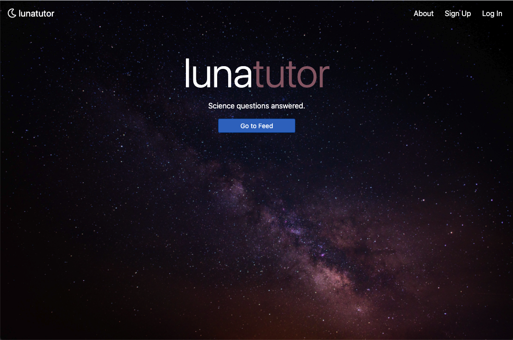
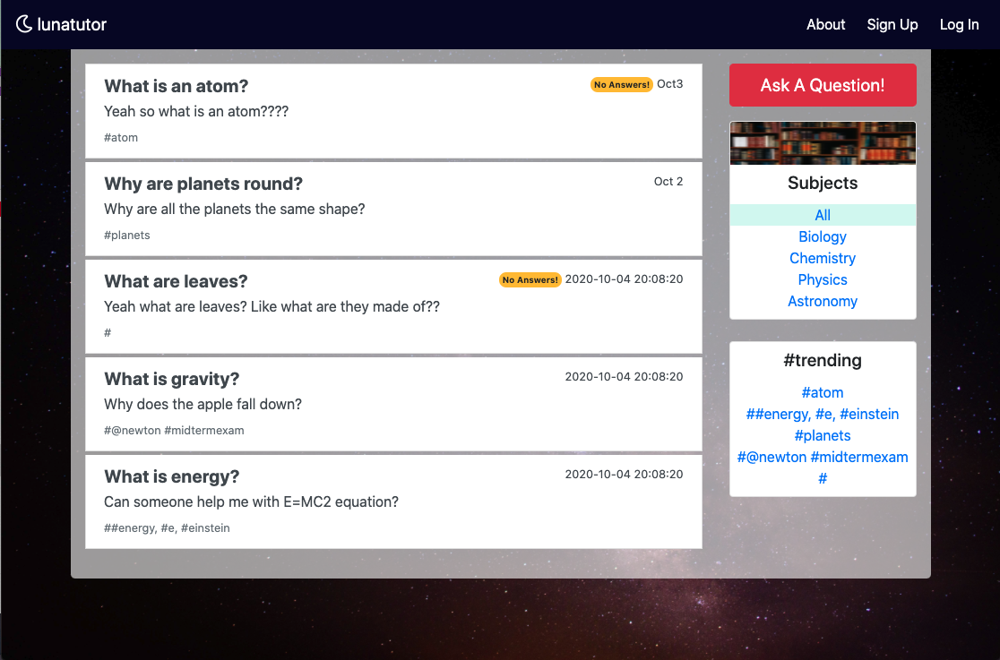

# lunaTutor

Luna tutor was created for the 2020 NASA SpaceApps Challenge in Seattle.

2020 has been a difficult year for everyone, but it has been especially hard on K-12 students new to remote learning who have had to adapt to a new
way of learning in a short amount of time. With teachers not as accessible as they are able to be inside a classroom, we feared that students were in
need of an additional place to ask their science-related questions. This is what inspired us to create lunatutor, a space where anyone can ask and
answer questions relating to science.

## Picture Of lunaTutor

 

## User Flow

- Users can view the feed where questions are stored from other users.
- Users can post science related questions.
- Users can optionally interact with the feed by creating an account.
- Users assist others by commenting on questions.

## Tools Used

- Flask (Python)
- PostgreSQL
- SQLAlchemy
- jQuery/Bootstrap
- axios for AJAX functionality
- Bcrypt - used to hash sensitive user data
